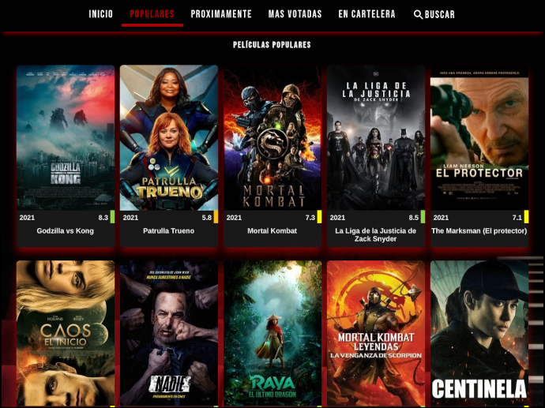

# REACT-MOVIE-API with Hooks

## Table of Contents
1. [General Info](#general-info)
2. [Technologies](#technologies)
3. [Installation](#installation)
4. [Collaboration](#collaboration)
5. [License](#License)

### General Info
A complete database web application designed with React Hooks using the [Themoviedb] API (https://developers.themoviedb.org/3) - Version 3. The web application displays different lists of movies (most popular, top rated, current and upcoming), as well as offering a search bar for your own movie search. Clicking on a movie opens a pop-up window with detailed information about it.

### Screenshot


#### Responsive Design:




## Technologies
***
A list of technologies used within the project:
* [React](https://reactjs.org/): Version 17.0.2 
* [React-router-dom](https://www.npmjs.com/package/react-router-dom): Version 5.2.0
* [Node-sass](https://www.npmjs.com/package/node-sass): Version 5.0.0
* [Material-ui](https://material-ui.com/): Version 4.11.2
* [Axios](https://www.npmjs.com/package/axios): Version 0.21.1

## Installation
***
A little intro about the installation: 
```
$ git clone https://github.com/pardo30/MoviesAPI.git
$ cd ../path/to/the/file
$ npm install
$ npm start
```
Api request with Axios with GET method and UseEffect Hooks:
~~~
useEffect(() => {
        axios.get(`https://api.themoviedb.org/3/movie/{movie_id}?api_key=<<api_key>>&language=en-US`)
        .then(res=> setMovies(res.data.results))
        .catch(error => console.error(error))
    }, []);
~~~
API calls:
* Get the most newly created movie: `https://api.themoviedb.org/3/movie/latest?api_key=<<api_key>>&language=en-US`
* Get a list of movies in theatres: `https://api.themoviedb.org/3/movie/now_playing?api_key=<<api_key>>&language=en-US`
* Get a list of the current popular movies on TMDB: `https://api.themoviedb.org/3/movie/popular?api_key=<<api_key>>&language=en-US`
* Get the top rated movies on TMDB: `https://api.themoviedb.org/3/movie/top_rated?api_key=<<api_key>>&language=en-US`
* Get a list of upcoming movies in theatres: `https://api.themoviedb.org/3/movie/upcoming?api_key=<<api_key>>&language=en-US`
* Search using Movie Id: `ttps://api.themoviedb.org/3/search/movie?api_key=<<api_key>>&language=en-US`

## collaboration
***
Pull requests are welcome. For major changes, please open an issue first to discuss what you would like to change.

Please make sure to update tests as appropriate.

## License
***
This app is released as open source under the terms of the [MIT License](https://choosealicense.com/licenses/mit/)
~~~
Copyright 2021 Pardo30

Permission is hereby granted, free of charge, to any person obtaining a copy of this software and associated documentation files (the "Software"), to deal in the Software without restriction, including without limitation the rights to use, copy, modify, merge, publish, distribute, sublicense, and/or sell copies of the Software, and to permit persons to whom the Software is furnished to do so, subject to the following conditions:

The above copyright notice and this permission notice shall be included in all copies or substantial portions of the Software.

THE SOFTWARE IS PROVIDED "AS IS", WITHOUT WARRANTY OF ANY KIND, EXPRESS OR IMPLIED, INCLUDING BUT NOT LIMITED TO THE WARRANTIES OF MERCHANTABILITY, FITNESS FOR A PARTICULAR PURPOSE AND NONINFRINGEMENT. IN NO EVENT SHALL THE AUTHORS OR COPYRIGHT HOLDERS BE LIABLE FOR ANY CLAIM, DAMAGES OR OTHER LIABILITY, WHETHER IN AN ACTION OF CONTRACT, TORT OR OTHERWISE, ARISING FROM, OUT OF OR IN CONNECTION WITH THE SOFTWARE OR THE USE OR OTHER DEALINGS IN THE SOFTWARE.
~~~